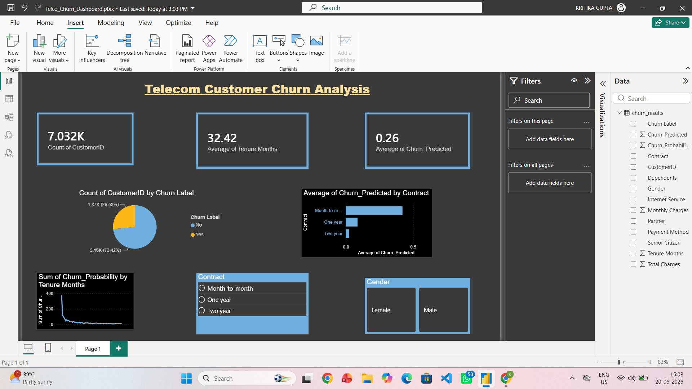

# Telecom Customer Churn Prediction

End-to-end data science project for predicting telecom customer churn using Python and Machine Learning, with model outputs visualized in an interactive Power BI dashboard.

## Tools & Technologies

- **Python:** Pandas, Scikit-learn, Matplotlib, Seaborn
- **Machine Learning:** Random Forest Classifier
- **Power BI:** Interactive dashboard for churn insights
- **Dataset:** IBM Telco Customer Churn dataset

## Dashboard Preview



## Project Workflow

1. **Data Loading & EDA:** explored customer profile, services, contract, billing, and churn distribution.
2. **Data Cleaning:** handled missing `Total Charges` values and fixed numeric data types.
3. **Feature Engineering:** converted churn labels to binary values and label encoded categorical features.
4. **Model Training:** trained a Random Forest Classifier with an 80/20 stratified train-test split.
5. **Model Evaluation:** evaluated accuracy, classification report, confusion matrix, and feature importance.
6. **Export:** exported customer-level churn predictions and probabilities for Power BI.
7. **Dashboard:** built a Power BI report with KPIs, charts, and slicers for contract and gender analysis.

## Key Results

- **Model Accuracy:** 78.61%
- **Prediction Export:** 7,032 customer records
- **Top Churn Drivers:** Total Charges, Monthly Charges, Tenure Months, CLTV, and Contract
- Dashboard highlights churn by contract type, tenure, gender, and predicted churn probability.

## Repository Contents

| Path | Description |
| --- | --- |
| `src/churn_analysis.py` | Reproducible Python ML pipeline from data loading to export |
| `churn_analysis.ipynb` | Notebook entry point for running the project in Jupyter |
| `Telecom_Churn_Analysis.html` | Original exported notebook/report HTML |
| `data/Telco_customer_churn.xlsx` | IBM Telco Customer Churn dataset |
| `data/churn_results.csv` | Model predictions used in Power BI |
| `reports/Telco_Churn_Dashboard.pbix` | Power BI dashboard file |
| `reports/model_metrics.txt` | Accuracy and classification report |
| `reports/feature_importance.csv` | Feature importance values from the trained model |
| `assets/dashboard.png` | Power BI dashboard screenshot |
| `assets/confusion_matrix.png` | Confusion matrix visualization |
| `assets/feature_importance.png` | Top feature importance chart |

## How to Run

1. Clone this repository.
2. Install dependencies:

```bash
pip install -r requirements.txt
```

3. Run the ML pipeline:

```bash
python src/churn_analysis.py
```

4. Open `reports/Telco_Churn_Dashboard.pbix` in Power BI Desktop.
5. If needed, refresh the dashboard data source to use `data/churn_results.csv`.

## Model Summary

The Random Forest model predicts whether a customer is likely to churn and exports both the predicted class and churn probability. These outputs are used in Power BI to analyze customer risk across contract type, tenure, gender, and billing behavior.
